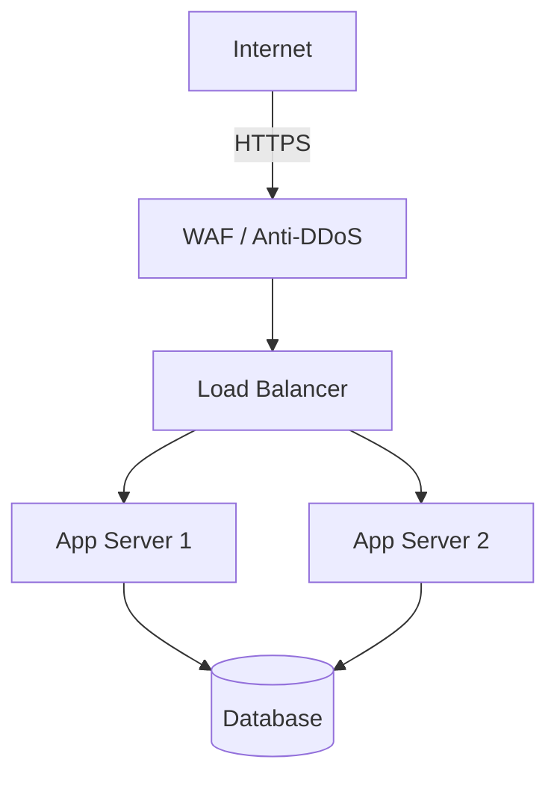

# SecureArch — Руководство пользователя

> Портал управления архитектурой информационной безопасности предприятия

---

## Содержание

1. [Что такое SecureArch](#1-что-такое-securearch)
2. [Принципы и иерархия данных](#2-принципы-и-иерархия-данных)
3. [Интерфейс и навигация](#3-интерфейс-и-навигация)
4. [Подключение к базе данных](#4-подключение-к-базе-данных)
5. [Разделы портала](#5-разделы-портала)
   - 5.1 [Библиотека потребителя](#51-библиотека-потребителя)
   - 5.2 [Организационные домены](#52-организационные-домены)
   - 5.3 [Технические домены](#53-технические-домены)
   - 5.4 [Технологии](#54-технологии)
   - 5.5 [Требования безопасности](#55-требования-безопасности)
   - 5.6 [Технические решения](#56-технические-решения)
   - 5.7 [Харденинг](#57-харденинг)
   - 5.8 [Типовые архитектуры](#58-типовые-архитектуры)
   - 5.9 [Продукты](#59-продукты)
   - 5.10 [Аналитика](#510-аналитика)
   - 5.11 [Импорт и экспорт данных](#511-импорт-и-экспорт-данных)
6. [Ролевая модель](#6-ролевая-модель)
7. [Типовые сценарии работы](#7-типовые-сценарии-работы)
8. [Статусы и жизненный цикл объектов](#8-статусы-и-жизненный-цикл-объектов)
9. [Часто задаваемые вопросы](#9-часто-задаваемые-вопросы)

---

## 1. Что такое SecureArch

**SecureArch** — корпоративный портал для централизованного управления архитектурой информационной безопасности (ИБ). Предназначен для команд ИБ, архитекторов и специалистов по соответствию нормативным требованиям.

### Для кого предназначен портал

| Роль | Основные задачи в системе |
|------|--------------------------|
| **CISO / Руководитель ИБ** | Контроль аналитики, согласование архитектур и решений |
| **Архитектор ИБ** | Разработка типовых архитектур, технических решений |
| **Специалист ИБ** | Ведение реестра требований, технологий, доменов |
| **Потребитель** | Поиск применимых требований в «Библиотеке потребителя» |
| **Аудитор** | Просмотр требований, экспорт данных для проверки |

### Что можно делать

- Вести реестр **требований ИБ** с привязкой к нормативным документам (ГОСТ, ISO 27001, PCI DSS, NIST CSF)
- Хранить каталог **технологий безопасности** с версиями и статусами
- Описывать **технические решения** с харденингом и согласованием
- Создавать **типовые архитектуры** с Mermaid-диаграммами
- Привязывать **продукты** к конкретным архитектурам
- Искать все объекты через **единую библиотеку**
- Отслеживать метрики соответствия на **дашборде аналитики**
- **Экспортировать и импортировать** данные в форматах JSON и CSV

---

## 2. Принципы и иерархия данных

### Главный принцип: всё связано

Портал построен на системе взаимосвязанных объектов. Каждое требование имеет контекст: к какому домену относится, на какой технологии основано, каким техническим решением реализуется.

### Иерархия объектов

```
ОРГАНИЗАЦИЯ
│
├── Организационные домены        ← Бизнес-направления ИБ
│   └── Технические домены        ← Технические области
│       └── Технологии            ← Конкретные продукты и инструменты
│           └── Требования        ← Требования к технологии
│
├── Технические решения           ← Как реализовать требование
│   └── Харденинг                 ← Детали настройки решения
│
├── Типовые архитектуры           ← Шаблоны проектирования систем
│   └── Продукты                  ← Конкретные продукты организации
│
└── Требования (сводный реестр)
```

### Пример связи

```
Орг. домен: "Сетевая безопасность"
  └─ Тех. домен: "Защита периметра"
       └─ Технология: "Check Point Firewall v1.2"
            └─ Требование: "Запрет прямого доступа в DMZ из LAN" (Критический)
                 └─ Тех. решение: "Сегментация через DMZ-зону"
                      └─ Харденинг: "Deploy: VLAN isolation + ACL rules"
                           └─ Архитектура: "Типовая DMZ для веб-сервисов"
```

### Атрибуты объектов

Каждый объект в портале имеет стандартные атрибуты:

| Атрибут | Описание |
|---------|----------|
| **ID** | Уникальный идентификатор (задаётся вручную) |
| **Название** | Человекочитаемое имя объекта |
| **Версия** | Версия в формате `X.Y.Z` (семантическое версионирование) |
| **Статус** | Текущий жизненный цикл объекта |
| **Владелец** | Ответственное лицо или команда |
| **Теги** | Метки для группировки и поиска |
| **Описание** | Подробное описание объекта |

---

## 3. Интерфейс и навигация

### Общий вид

```
┌────────────────────────────────────────────────────────────────┐
│  SecureArch [MVP]                    [● DB]  [⚙]  [↕ Данные] │
├────────────────────────────────────────────────────────────────┤
│ [Библиотека] [Орг.домены] [Тех.домены] [Технологии]           │
│ [Требования] [Техрешения] [Харденинг] [Архитектуры]           │
│ [Продукты] [Аналитика]                                        │
├────────────────────────────────────────────────────────────────┤
│                                                                │
│   Содержимое текущего раздела                                 │
│                                                                │
└────────────────────────────────────────────────────────────────┘
```

### Элементы шапки

| Элемент | Назначение |
|---------|-----------|
| **SecureArch [MVP]** | Логотип и версия платформы |
| **● DB** | Индикатор подключения к БД (зелёный = ОК, красный = ошибка) |
| **⚙** | Настройки подключения к базе данных |
| **↕ Данные** | Импорт и экспорт всех данных портала |

### Навигация

Переключение разделов происходит через горизонтальное меню. Активный раздел выделяется. Все 11 разделов:

1. Библиотека потребителя
2. Организационные домены
3. Технические домены
4. Технологии
5. Требования
6. Технические решения
7. Харденинг
8. Типовые архитектуры
9. Продукты
10. Аналитика
11. *(Экспорт/Импорт через кнопку в шапке)*

### Общий паттерн работы с разделами

В большинстве разделов интерфейс выглядит единообразно:

```
┌──────────────────────────────────────────────────┐
│ Название раздела                                 │
│ Описание (редактируется по клику на карандаш ✎) │
│                                           [+ Добавить] │
├──────────────────────────────────────────────────┤
│ Поиск: [__________________]                     │
│ Фильтры: [Тип ▼] [Статус ▼] [Домен ▼] ...     │
├──────────────────────────────────────────────────┤
│ Список карточек или строк с объектами           │
│                                                  │
│ На каждой карточке: [👁] [✎] [🗑]            │
└──────────────────────────────────────────────────┘
```

**Кнопки на карточках:**
- **👁 Просмотр** — открывает боковую панель с подробной информацией
- **✎ Редактировать** — открывает форму редактирования
- **🗑 Удалить** — удаляет объект (с запросом подтверждения)

---

## 4. Подключение к базе данных

### Режимы работы

Портал поддерживает два режима хранения данных:

| Режим | Когда использовать |
|-------|--------------------|
| **Облачная БД (по умолчанию)** | Работа в браузере через poehali.dev. Данные хранятся в облаке. |
| **Внешняя PostgreSQL** | Локальный запуск через Docker или корпоративная инфраструктура |

### Настройка подключения

1. Нажмите кнопку **⚙** в правом верхнем углу
2. Выберите режим:
   - **Сервисная БД** — для облачного режима
   - **Внешняя БД** — для корпоративной или Docker-БД
3. При выборе внешней БД заполните поля:
   ```
   Хост:     your-db-host.example.com
   Порт:     5432
   База:     securearch_db
   Логин:    admin
   Пароль:   ••••••••
   ```
4. Нажмите **Проверить подключение** (опционально)
5. Нажмите **Сохранить**

### Индикатор статуса

- **● (зелёный)** — подключение активно, данные доступны
- **● (красный)** — ошибка подключения, проверьте настройки
- **● (серый)** — проверка не выполнялась

---

## 5. Разделы портала

---

### 5.1 Библиотека потребителя

**Назначение:** единая точка поиска по всем объектам портала для потребителей архитектуры ИБ — разработчиков, DevOps-инженеров, архитекторов продуктов.

#### Как выглядит

```
┌────────────────────────────────────────────────────────┐
│ Библиотека потребителя                                │
├────────────────────────────────────────────────────────┤
│ 🔍 Поиск по всем объектам...                         │
├────────────────────────────────────────────────────────┤
│ [Все] [Требования] [Технологии] [Техрешения]          │
│ [Архитектуры]                                         │
│                                                        │
│ Статус: [Все ▼]    Тип: [Все ▼]                      │
│                                                        │
│ Найдено объектов: 43                                  │
├────────────────────────────────────────────────────────┤
│ ☑ [Требование] [Безопасность] [Критичный]            │
│   Управление доступом и идентификация                 │
│                                           [Подробнее ▼] │
│                                                        │
│ ☑ [Технология] [Активен]                             │
│   HashiCorp Vault v1.15                              │
│                                           [Подробнее ▼] │
│                                                        │
│ ☐ [Архитектура] [Активен]                            │
│   Типовая DMZ для веб-сервисов                       │
│                                           [Подробнее ▼] │
├────────────────────────────────────────────────────────┤
│ ДЕТАЛЬНЫЙ ПРОСМОТР (при нажатии [Подробнее])         │
│                                                        │
│ HashiCorp Vault [v1.15]                              │
│ Статус: Активен ●    Тип: Технология                 │
│                                                        │
│ Описание: Система управления секретами...            │
│ Теги: #secrets #vault #pki                           │
│                                                        │
│ Связанные требования (8)                             │
│ ┌─────────────────────────────────────────────────┐  │
│ │ Фильтр: [Статус ▼] [Окружение ▼] [Стадия ▼]   │  │
│ │                                                   │  │
│ │ ИБ-041 | Критический | Prod, ProdLike | v1.0   │  │
│ │ ИБ-042 | Высокий     | Prod           | v1.0   │  │
│ │                                [📥 Экспорт CSV] │  │
│ └─────────────────────────────────────────────────┘  │
└────────────────────────────────────────────────────────┘
```

#### Пошаговый сценарий: найти требования к конкретной технологии

1. Перейдите в **Библиотека потребителя**
2. Введите название технологии в строку поиска (например, `Vault`)
3. Нажмите таб **Технологии** для фильтрации по типу
4. Кликните **Подробнее** на нужном объекте
5. В разделе «Связанные требования» настройте фильтры:
   - **Окружение:** Prod (для production-требований)
   - **Статус:** Активен (актуальные требования)
6. Нажмите **📥 Экспорт CSV** — получите файл с полным перечнем требований

#### Что экспортируется в CSV

| Колонка | Описание |
|---------|----------|
| ID | Уникальный идентификатор требования |
| Название | Название требования |
| Тип | Организационное / Функциональное / Безопасность / Техническое |
| Критичность | Критический / Высокий / Средний / Низкий |
| Статус | Текущий статус |
| Версия | Версия требования |
| Домен | Технический домен |
| Технология | Связанная технология |
| Описание | Полный текст требования |
| Метрика | Метрика выполнения |
| Норм. документ | Ссылка на ГОСТ/ISO/PCI DSS/NIST |
| Окружения | Prod, Stage, Test... |
| Стадии | Дизайн, Деплой, Рантайм |
| Теги | Метки |

---

### 5.2 Организационные домены

**Назначение:** верхнеуровневые бизнес-направления информационной безопасности (например: «Управление идентификацией», «Сетевая безопасность», «Криптографическая защита»).

#### Структура карточки домена

```
┌─────────────────────────────────────┐
│ org.dom.001          v1.2.0         │
│ [Активен ●]                         │
│                                     │
│ Управление идентификацией           │
│ и доступом (IAM)                    │
│                                     │
│ Владелец: Отдел ИБ                  │
│                                     │
│ Теги: #iam #access #identity        │
│                                     │
│ [👁 Просмотр]  [✎]  [🗑]         │
└─────────────────────────────────────┘
```

#### Форма создания/редактирования

| Поле | Обязательное | Описание |
|------|:---:|---------|
| ID | ✅ | Уникальный код: `org-dom-001` |
| Название | ✅ | Человекочитаемое название |
| Версия | ✅ | Формат: `1.0.0` |
| Владелец | — | Команда или ФИО ответственного |
| Статус | ✅ | Из выпадающего списка |
| Описание | — | Подробное описание назначения |
| Теги | — | Через запятую или Enter |

---

### 5.3 Технические домены

**Назначение:** технические направления ИБ внутри организационных доменов. Технический домен — это более конкретная область (например: «Защита периметра», «PKI-инфраструктура», «SIEM и мониторинг»).

#### Отличие от организационных доменов

- **Организационный домен** — бизнес-уровень: «Сетевая безопасность»
- **Технический домен** — технический уровень: «Защита периметра», «Сегментация сетей», «VPN-шлюзы»

Технический домен **обязательно привязан** к организационному домену.

#### Дополнительные поля

| Поле | Описание |
|------|----------|
| Организационный домен | Привязка к родительскому домену |
| Тип | Тип технического компонента |

---

### 5.4 Технологии

**Назначение:** каталог всех технологий, продуктов и инструментов ИБ, используемых в организации.

#### Примеры технологий

- HashiCorp Vault 1.15 (управление секретами)
- Check Point R81.20 (межсетевой экран)
- CrowdStrike Falcon (EDR)
- Elasticsearch 8.x (хранение логов)

#### Особенности раздела

**Версионирование технологии:**
Одна технология может иметь несколько версий — каждая со своим статусом. Например:
```
HashiCorp Vault
  └─ v1.15 (Активен)
  └─ v1.14 (Устарел)
  └─ v1.13 (Архив)
```

**Вложения:**
К каждой технологии можно прикрепить:
- Ссылки на документацию
- Архитектурные диаграммы (Mermaid)
- Файлы (PDF, DOCX)

#### Форма создания технологии

| Поле | Описание |
|------|----------|
| ID | `tech-001` |
| Название | Полное название продукта |
| Версия | Текущая версия |
| Технический домен | Привязка к домену |
| Статус | Активен / Устарел / В разработке... |
| Владелец | Ответственная команда |
| Описание | Для чего используется |
| Теги | `#siem #logging #elk` |
| Вложения | Ссылки и файлы |

---

### 5.5 Требования безопасности

**Назначение:** центральный реестр всех требований ИБ с полным атрибутивным составом. Это сердце портала — именно требования являются основным продуктом для потребителей.

#### Структура требования

```
┌──────────────────────────────────────────────────────────┐
│ Управление привилегированным доступом    [ИБ-011]       │
│ v1.0  Статус: Активен ●   Тип: Безопасность            │
│                                                          │
│ Критичность: [Критический ●]                            │
│ Технология: HashiCorp Vault                             │
│ Домен: Управление идентификацией                        │
│                                                          │
│ Описание:                                               │
│ Весь привилегированный доступ к системам должен         │
│ осуществляться только через PAM-систему...              │
│                                                          │
│ ────────────────────────────────────────────────────── │
│ ПРИМЕНИМОСТЬ                                             │
│                                                          │
│ Окружения:  [Prod] [ProdLike] [Stage]                  │
│ Стадии:     [Стадия дизайн] [Стадия деплоя]           │
│                                                          │
│ Уровень:    [Обязательный]                              │
│                                                          │
│ ────────────────────────────────────────────────────── │
│ КОНТРОЛЬ                                                 │
│                                                          │
│ Метрика: % систем с подключённым PAM                   │
│ Контроль: Ежеквартальный аудит + автосканирование      │
│                                                          │
│ ────────────────────────────────────────────────────── │
│ НОРМАТИВНАЯ БАЗА                                         │
│                                                          │
│ Норм. документ: → ISO 27001 A.9.4                      │
│                                                          │
│ Теги: #pam #privileged #access                         │
└──────────────────────────────────────────────────────────┘
```

#### Атрибуты требования

**Классификация:**

| Тип требования | Описание |
|---------------|----------|
| Организационное | Процессы, регламенты, процедуры |
| Функциональное | Функции системы или продукта |
| Безопасность | Требования к защите |
| Техническое | Технические параметры реализации |

**Уровни критичности:**

| Критичность | Значение |
|------------|----------|
| 🔴 Критический | Несоответствие = критический риск для организации |
| 🟠 Высокий | Существенный риск, требует приоритетного внимания |
| 🟡 Средний | Умеренный риск, плановое устранение |
| 🟢 Низкий | Минимальный риск, Best Practice |

**Окружения применения:**

| Окружение | Описание |
|-----------|----------|
| Prod | Промышленная эксплуатация |
| ProdLike | Среда, аналогичная production (нагрузочное тестирование) |
| Stage | Предпромышленное тестирование |
| Test | Среда тестирования |
| Dev | Среда разработки |

**Стадии применения:**

| Стадия | Когда требование проверяется |
|--------|------------------------------|
| Стадия дизайн | При проектировании системы (архитектурный ревью) |
| Стадия деплоя | При развёртывании (CI/CD, чеклист) |
| Стадия рантайм | В процессе эксплуатации (мониторинг, аудит) |

**Уровни взаимодействия:**

| Уровень | Значение |
|---------|----------|
| Обязательный | Должно быть выполнено без исключений |
| Рекомендуемый | Настоятельно рекомендуется |
| Не требуется | Опционально |
| Запрещено | Явный запрет |

#### Фильтры в разделе требований

```
┌──────────────────────────────────────────────────────────┐
│ Поиск: [___________________________________________]     │
│                                                          │
│ Тип:         [Все ▼] [Орг.] [Функц.] [Безоп.] [Техн.] │
│ Критичность: [Все ▼] [Крит.] [Высок.] [Средн.] [Низ.] │
│ Статус:      [Все ▼] [Активен] [В разработке] [Архив]  │
│ Окружение:   [Все ▼] [Prod] [Stage] [Test] [Dev]       │
│ Стадия:      [Все ▼] [Дизайн] [Деплой] [Рантайм]     │
│ Домен:       [Все домены ▼]                             │
│ Технология:  [Все технологии ▼]                         │
└──────────────────────────────────────────────────────────┘
```

---

### 5.6 Технические решения

**Назначение:** описание конкретных технических решений, реализующих требования безопасности. Если требование — это «ЧТО нужно сделать», то техническое решение — это «КАК это сделать».

#### Пример

```
Требование: "Все секреты должны храниться в централизованном хранилище"
                           ↓
Техническое решение: "Развертывание HashiCorp Vault в HA-режиме"
   - Используемые технологии: HashiCorp Vault 1.15, etcd, Consul
   - Согласовано: ИБ ✅  IT ✅
   - Описание архитектуры решения...
   - Вложения: схема развёртывания, инструкции
```

#### Процесс согласования

Техническое решение проходит двойное согласование:

```
Черновик → На согласовании → ИБ согласовало → IT согласовало → Активен
```

| Статус согласования | Значение |
|---------------------|----------|
| ✅ Согласовано ИБ | Служба ИБ подтвердила соответствие требованиям |
| ✅ Согласовано IT | IT-архитектура подтвердила реализуемость |
| ⏳ Ожидает | Решение на рассмотрении |

#### Дополнительные поля

| Поле | Описание |
|------|----------|
| Используемые технологии | Список технологий из каталога |
| Связанные решения | Ссылки на смежные техрешения |
| Вложения | Документация, диаграммы, ссылки |

---

### 5.7 Харденинг

**Назначение:** детальные технические настройки безопасности для конкретного технического решения. Харденинг — это набор конфигурационных параметров, которые необходимо применить при развёртывании или настройке решения.

#### Два вида харденинга

| Вид | Описание | Пример |
|-----|----------|--------|
| **Deploy Hardening** | Настройки при развёртывании | VLAN isolation, TLS-only, отключение дефолтных учёток |
| **Functional Hardening** | Функциональные настройки безопасности | Минимальные права, ротация токенов, аудит-логи |

#### Связь с техническим решением

```
Техническое решение: "HashiCorp Vault HA"
   ├── Deploy Hardening: "Vault Network Hardening"
   │     - TLS 1.2+ для всех соединений
   │     - Запрет HTTP-трафика
   │     - Firewall: только необходимые порты
   │
   └── Functional Hardening: "Vault Access Hardening"
         - Минимальные TTL для токенов
         - AppRole вместо root token
         - Включение Audit backend
```

---

### 5.8 Типовые архитектуры

**Назначение:** шаблоны архитектур защищённых систем. Это «чертежи», которые команды используют при проектировании новых продуктов.

#### Что включает типовая архитектура

```
┌─────────────────────────────────────────────────────────┐
│ Типовая архитектура: DMZ для веб-сервисов               │
│ v2.0.0    Статус: Активен                              │
│                                                         │
│ Согласования: ИБ ✅   IT ✅                            │
│                                                         │
│ ОПИСАНИЕ                                               │
│ Изолированная зона DMZ для размещения публично         │
│ доступных веб-сервисов с многоуровневой защитой...    │
│                                                         │
│ ДИАГРАММА АРХИТЕКТУРЫ                                  │
│ ┌─────────────────────────────────────────────────┐   │
│ │  graph TB                                        │   │
│ │    Internet --> WAF                              │   │
│ │    WAF --> LB[Load Balancer]                    │   │
│ │    LB --> DMZ[DMZ Zone]                         │   │
│ │    DMZ --> FW[Internal Firewall]                │   │
│ │    FW --> LAN[Internal Network]                 │   │
│ │  [Rendered Mermaid Diagram]                     │   │
│ └─────────────────────────────────────────────────┘   │
│                                                         │
│ СВЯЗАННЫЕ ТЕХРЕШЕНИЯ (3)                              │
│ • WAF-решение на базе nginx + ModSecurity            │
│ • HA Load Balancer (HAProxy)                         │
│ • Межсетевой экран периметра (Check Point)           │
│                                                         │
│ СВЯЗАННЫЕ ТРЕБОВАНИЯ (12)                             │
│ Фильтры: [Окружение ▼] [Статус ▼]                   │
│ • ИБ-001  Критический  Prod ProdLike                │
│ • ИБ-004  Высокий      Prod Stage                   │
│ ...                                         [CSV ↓]   │
└─────────────────────────────────────────────────────────┘
```

#### Диаграммы Mermaid

Диаграммы создаются в синтаксисе [Mermaid](https://mermaid.js.org/) — текстовое описание автоматически рендерится в визуальную схему:



---

### 5.9 Продукты

**Назначение:** реестр конкретных продуктов и систем организации с привязкой к типовым архитектурам ИБ.

#### Отличие от архитектур

- **Типовая архитектура** — шаблон (Generic)
- **Продукт** — конкретная реализация этого шаблона

```
Типовая архитектура: "DMZ для веб-сервисов"
   ├── Продукт: "Интернет-банк клиента"  (CMDB: IB-PROD-001)
   ├── Продукт: "Корпоративный портал"   (CMDB: CP-PROD-002)
   └── Продукт: "API Gateway"            (CMDB: APIGW-003)
```

#### Дополнительные поля продукта

| Поле | Описание |
|------|----------|
| CMDB мнемоники | Идентификаторы в системе управления конфигурациями |
| Изображение | Логотип или скриншот продукта |
| Архитектурная диаграмма | Mermaid-диаграмма конкретной реализации |

---

### 5.10 Аналитика

**Назначение:** дашборд метрик соответствия требованиям безопасности и общего состояния ИБ.

#### Ключевые метрики (KPI)

```
┌────────────┐ ┌────────────┐ ┌────────────┐ ┌────────────┐
│  Всего     │ │ Выполнено  │ │  В работе  │ │Критических │
│требований  │ │            │ │            │ │ нарушений  │
│    247     │ │   74%      │ │    41      │ │     8      │
└────────────┘ └────────────┘ └────────────┘ └────────────┘
```

#### Соответствие стандартам

| Стандарт | Описание |
|---------|----------|
| **ГОСТ Р 57580** | Требования ЦБ РФ к защите финансовых организаций |
| **ISO 27001** | Международный стандарт управления ИБ |
| **PCI DSS 4.0** | Стандарт безопасности платёжных карт |
| **NIST CSF** | Фреймворк кибербезопасности NIST |

Для каждого стандарта отображается диаграмма — процент выполненных требований.

---

### 5.11 Импорт и экспорт данных

**Назначение:** резервное копирование, миграция данных между экземплярами портала, интеграция с внешними системами.

#### Как открыть

Нажмите кнопку **↕ Данные** в правом верхнем углу.

#### Форматы

```
┌────────────────────────────────────────────────┐
│ Экспорт данных                                │
│                                                │
│ [📥 Экспорт в JSON]    [📥 Экспорт в CSV]     │
│  Полный бандл           Таблицы для Excel      │
│  всех объектов                                 │
│                                                │
│ ────────────────────────────────────────────── │
│                                                │
│ Импорт данных                                 │
│                                                │
│ [📤 Импорт из JSON]   [📤 Импорт из CSV]      │
│  Восстановление         Загрузка из Excel      │
│  из резервной копии                            │
└────────────────────────────────────────────────┘
```

#### Сценарии использования

**Резервное копирование:**
```
Экспорт в JSON → сохранить файл → при необходимости → Импорт из JSON
```

**Перенос между средами:**
```
Prod-БД → Экспорт JSON → Тестовая среда → Импорт JSON
```

**Интеграция с Excel:**
```
Экспорт в CSV → Открыть в Excel → Анализ → Редактировать → Импорт из CSV
```

**Передача данных внешним системам:**
```
Экспорт в CSV → Загрузить в Jira / Confluence / GRC-систему
```

---

## 6. Ролевая модель

Портал не имеет встроенного разграничения прав доступа — все пользователи видят и могут редактировать все данные. Ролевая модель носит **организационный** характер: договорённость внутри команды о том, кто за что отвечает.

### Роли и зоны ответственности

#### Потребитель архитектуры ИБ
> Разработчики, DevOps-инженеры, архитекторы продуктов

**Основной раздел:** Библиотека потребителя

**Что делает:**
- Ищет требования к своему продукту или технологии
- Фильтрует требования по окружению (Prod, Stage) и стадии (Дизайн, Деплой, Рантайм)
- Экспортирует требования в CSV для чеклистов и задач в Jira/Confluence
- Просматривает типовые архитектуры при проектировании новых систем

**Что НЕ делает:** не создаёт и не редактирует объекты портала

**Типичный сценарий:**
```
Получил задачу → Зашёл в Библиотеку → Нашёл технологию/архитектуру →
Отфильтровал требования по Prod + Дизайн → Экспортировал CSV →
Передал список команде для выполнения
```

---

#### Специалист ИБ
> Инженеры и аналитики службы информационной безопасности

**Основные разделы:** Требования, Технологии, Технические домены, Организационные домены

**Что делает:**
- Ведёт реестр требований: создаёт, обновляет, версионирует
- Регистрирует новые технологии и обновляет их статусы (Активен / Устарел)
- Поддерживает актуальность доменов
- Привязывает требования к нормативным документам (ГОСТ, ISO, PCI DSS)
- Переводит устаревшие объекты в статус «Архив» или «Устарел»

**Не делает:** не согласовывает технические решения и архитектуры (это роль архитектора ИБ)

**Матрица доступа к разделам:**

| Раздел | Просмотр | Создание | Редактирование | Удаление |
|--------|:--------:|:--------:|:--------------:|:--------:|
| Библиотека | ✅ | — | — | — |
| Орг. домены | ✅ | ✅ | ✅ | ✅ |
| Тех. домены | ✅ | ✅ | ✅ | ✅ |
| Технологии | ✅ | ✅ | ✅ | ✅ |
| Требования | ✅ | ✅ | ✅ | ✅ |
| Техрешения | ✅ | — | — | — |
| Харденинг | ✅ | — | — | — |
| Архитектуры | ✅ | — | — | — |
| Продукты | ✅ | — | — | — |
| Аналитика | ✅ | — | — | — |

---

#### Архитектор ИБ
> Старшие специалисты, руководители направлений, ГИП по ИБ

**Основные разделы:** Технические решения, Харденинг, Типовые архитектуры, Продукты, Аналитика

**Что делает:**
- Разрабатывает технические решения и описывает харденинг
- Создаёт и обновляет типовые архитектуры с Mermaid-диаграммами
- Согласовывает решения от стороны ИБ (проставляет ✅ ИБ)
- Привязывает продукты к типовым архитектурам
- Анализирует дашборд соответствия в Аналитике
- Управляет экспортом/импортом данных (резервные копии, миграции)

**Матрица доступа к разделам:**

| Раздел | Просмотр | Создание | Редактирование | Удаление |
|--------|:--------:|:--------:|:--------------:|:--------:|
| Библиотека | ✅ | — | — | — |
| Орг. домены | ✅ | ✅ | ✅ | — |
| Тех. домены | ✅ | ✅ | ✅ | — |
| Технологии | ✅ | ✅ | ✅ | — |
| Требования | ✅ | ✅ | ✅ | — |
| Техрешения | ✅ | ✅ | ✅ | ✅ |
| Харденинг | ✅ | ✅ | ✅ | ✅ |
| Архитектуры | ✅ | ✅ | ✅ | ✅ |
| Продукты | ✅ | ✅ | ✅ | ✅ |
| Аналитика | ✅ | — | — | — |
| Импорт/Экспорт | ✅ | — | — | — |

---

#### IT-архитектор
> Архитекторы IT-систем, технические лиды

**Основные разделы:** Технические решения, Типовые архитектуры, Продукты

**Что делает:**
- Просматривает требования к технологиям и архитектурам
- Согласовывает технические решения от стороны IT (проставляет ✅ IT)
- Предоставляет обратную связь по реализуемости требований
- Использует Библиотеку потребителя при проектировании систем

**Матрица доступа к разделам:**

| Раздел | Просмотр | Согласование |
|--------|:--------:|:-----------:|
| Библиотека | ✅ | — |
| Техрешения | ✅ | ✅ (поле IT) |
| Архитектуры | ✅ | ✅ (поле IT) |
| Продукты | ✅ | ✅ (поле IT) |
| Остальные | ✅ | — |

---

#### CISO / Руководитель ИБ
> Chief Information Security Officer, начальник службы ИБ

**Основные разделы:** Аналитика, просмотр любых объектов

**Что делает:**
- Контролирует общий уровень соответствия через дашборд Аналитики
- Просматривает критические требования и нарушения
- Принимает решения о приоритизации работ на основе KPI
- Согласовывает ключевые архитектурные решения

**Что НЕ делает:** не занимается операционным ведением данных в портале

**На что смотрит в Аналитике:**
```
Выполнено требований: 74%  ← Общий прогресс
Критические нарушения: 8   ← Требуют немедленного внимания
PCI DSS 4.0: 68%           ← Готовность к аудиту
ГОСТ Р 57580: 81%          ← Соответствие ЦБ РФ
```

---

### Процесс согласования объектов

Технические решения и архитектуры проходят двойное согласование. Рекомендуемый процесс:

```
Архитектор ИБ создаёт решение
         │
         ▼
    [Статус: В разработке]
         │
         ▼
IT-архитектор просматривает → проставляет ✅ IT
         │
         ▼
Архитектор ИБ проверяет → проставляет ✅ ИБ
         │
         ▼
    [Статус: Активен]
         │
         ▼
Специалист ИБ привязывает требования
         │
         ▼
Потребители находят через Библиотеку
```

---

### Рекомендации по организации работы команды

| Практика | Описание |
|----------|----------|
| **Единый владелец раздела** | Назначьте ответственного за каждый раздел (Требования → Специалист ИБ №1, Архитектуры → Архитектор ИБ №2) |
| **Версионирование при изменениях** | При любом смысловом изменении объекта — увеличивайте версию |
| **Статус «В разработке»** | Создавайте объекты в статусе «В разработке» и переводите в «Активен» только после проверки |
| **Регулярный ревью** | Раз в квартал просматривайте объекты в статусе «В разработке» и «Не активен» |
| **Тегирование** | Используйте единые теги для удобства поиска: `#critical`, `#pci-dss`, `#zero-trust` |

---

## 7. Типовые сценарии работы

### Сценарий 1: Онбординг нового продукта

> Задача: подготовить требования ИБ для нового продукта «Мобильный банк»

**Шаг 1.** Убедитесь, что нужные домены и технологии уже есть:
- Перейдите в **Технические домены** → проверьте наличие «Мобильная безопасность»
- Перейдите в **Технологии** → проверьте технологии (React Native, SSL Pinning, MFA)

**Шаг 2.** Найдите подходящую типовую архитектуру:
- Перейдите в **Типовые архитектуры**
- Введите в поиск «мобил» или «API»
- Откройте подходящую архитектуру

**Шаг 3.** Получите требования:
- В **Библиотека потребителя** найдите архитектуру
- Нажмите «Подробнее»
- Фильтр: Окружение = **Prod**, Критичность = **Критический**
- Экспортируйте в **CSV** для передачи команде разработки

**Шаг 4.** Создайте продукт:
- Перейдите в **Продукты** → **+ Добавить продукт**
- Укажите название, CMDB-идентификатор
- Привяжите к типовой архитектуре
- Добавьте архитектурную диаграмму

---

### Сценарий 2: Добавление новой технологии и требований

> Задача: добавить новый WAF-продукт и требования к нему

**Шаг 1.** Создайте технологию:
- **Технологии** → **+ Добавить**
- Заполните: ID, название, версия, домен = «Защита веб-приложений», статус = «В разработке»

**Шаг 2.** Создайте требования:
- **Требования** → **+ Добавить**
- Привяжите к новой технологии
- Укажите тип, критичность, окружения, стадии
- Добавьте контрольную метрику и ссылку на нормативный документ

**Шаг 3.** Создайте техническое решение:
- **Технические решения** → **+ Добавить**
- Привяжите технологию
- После согласования смените статус на «Активен»

**Шаг 4.** Добавьте харденинг:
- **Харденинг** → **+ Добавить**
- Выберите тип: Deploy или Functional
- Привяжите к техническому решению

---

### Сценарий 3: Аудит и отчётность

> Задача: подготовить отчёт по выполнению требований PCI DSS в production

**Шаг 1.** Откройте **Аналитику**:
- Посмотрите общий процент выполнения
- Найдите метрику PCI DSS 4.0

**Шаг 2.** Детализируйте через **Библиотеку потребителя**:
- Поиск: `PCI DSS`
- Тип: Требования
- Фильтр: Окружение = Prod

**Шаг 3.** Экспортируйте:
- Нажмите **📥 Экспорт CSV**
- Откройте в Excel
- Добавьте столбцы статуса выполнения вручную

---

## 8. Статусы и жизненный цикл объектов

### Статусы объектов

| Статус | Обозначение | Значение |
|--------|------------|----------|
| **Активен** | 🟢 Активен | Объект актуален и применяется |
| **В разработке** | 🔵 В разработке | Объект создаётся или обновляется |
| **Не активен** | ⚫ Не активен | Временно приостановлен |
| **Архив** | 🟡 Архив | Исторические данные, не применяется |
| **Устарел** | 🔴 Устарел | Заменён новым объектом |

### Рекомендуемый жизненный цикл

```
В разработке → Активен → Не активен (временно) → Архив
                                    ↓
                              Устарел (заменён)
```

### Версионирование

Используется семантическое версионирование **X.Y.Z**:
- **X** — мажорные изменения (несовместимые с предыдущей версией)
- **Y** — минорные добавления (обратно совместимые)
- **Z** — патчи, исправления

Примеры:
- `1.0.0` → первая версия
- `1.1.0` → добавлены новые требования
- `1.1.1` → исправлена опечатка в описании
- `2.0.0` → кардинальный пересмотр требований

---

## 9. Часто задаваемые вопросы

### Как найти требования для своего продукта?

Используйте **Библиотеку потребителя** — единая точка поиска. Найдите архитектуру или технологию, нажмите «Подробнее» и просмотрите связанные требования с нужными фильтрами.

### Как экспортировать требования в Excel?

1. Найдите нужный объект в Библиотеке потребителя
2. Разверните «Связанные требования»
3. При необходимости настройте фильтры
4. Нажмите «📥 Экспорт CSV»
5. Откройте файл `.csv` в Excel (кодировка UTF-8 with BOM — русский язык отобразится корректно)

### Что делать, если технологии или требования не загружаются?

Проверьте индикатор подключения БД (● в шапке). Если красный:
1. Нажмите ⚙ → проверьте настройки подключения
2. При работе в Docker — убедитесь что контейнеры запущены: `docker compose ps`
3. При работе в облаке — обновите страницу

### Как добавить Mermaid-диаграмму?

В форме редактирования Типовой архитектуры или Продукта есть поле для диаграммы. Вставьте код в синтаксисе Mermaid:

```
graph TD
    A[Клиент] -->|HTTPS| B[WAF]
    B --> C[Приложение]
    C --> D[(База данных)]
```

Диаграмма отрендерится автоматически при сохранении.

### Что такое «согласование ИБ и IT»?

Технические решения и архитектуры требуют двойного согласования:
- **ИБ** подтверждает соответствие требованиям безопасности
- **IT** подтверждает технологическую реализуемость и совместимость

Поля согласования проставляются вручную ответственными специалистами.

### Как правильно строить иерархию объектов?

Рекомендуемый порядок создания объектов:
1. Организационные домены
2. Технические домены (привязать к орг. доменам)
3. Технологии (привязать к тех. доменам)
4. Требования (привязать к технологиям)
5. Технические решения (привязать технологии)
6. Харденинг (привязать к техрешениям)
7. Типовые архитектуры (привязать техрешения)
8. Продукты (привязать архитектуры)

---

*Руководство актуально для версии SecureArch MVP. Последнее обновление: март 2026.*